# Proyecto MongoDB - Tienda de Borojó

## Autor
Proyecto desarrollado para demostrar operaciones avanzadas en MongoDB con un caso de uso real de comercio electrónico.
Daniel Florez Cubides

## Descripción del Proyecto

Este proyecto implementa una base de datos MongoDB para una tienda especializada en productos derivados del borojó, una fruta tropical del Pacífico colombiano conocida por sus propiedades energéticas y nutricionales.

### Escenario

La tienda "Borojó Natural" maneja un inventario de productos derivados del borojó, desde frutas frescas hasta productos procesados como jugos, mermeladas, cosméticos y hasta cerveza artesanal. El sistema debe gestionar:

- **Productos**: Catálogo con diferentes categorías y características
- **Clientes**: Base de datos de compradores con preferencias
- **Ventas**: Registro de transacciones realizadas
- **Inventario**: Control de stock y lotes
- **Proveedores**: Información de suministradores

## Estructura de la Base de Datos

### Colecciones:
- `productos`: Catálogo de productos con precios, stock y tags
- `clientes`: Información de clientes y sus preferencias
- `ventas`: Registro de transacciones
- `inventario`: Control de stock por lotes
- `proveedores`: Información de suministradores

## Instrucciones de Ejecución

### 1. Inicialización
```bash
# Conectar a MongoDB
mongosh

# Usar la base de datos
use tienda_borojo

```

## Ejercicios Desarrollados

### 1. Operaciones CRUD

#### Inserción
- ✅ Insertar producto "Chocolatina de borojó"
```javascript
db.productos.insertOne({
  nombre: "Chocolatina de borojó",
  categoria: "Snack",
  precio: 4000,
  stock: 35,
  tags: ["dulce", "energía"],
});
```
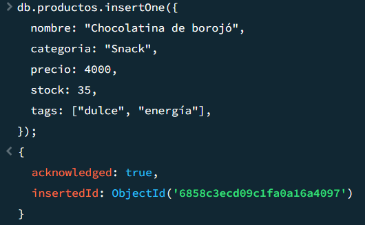
- ✅ Insertar cliente "Mario Mendoza"
```javascript
db.clientes.insertOne({
  nombre: "Mario Mendoza",
  email: "mario@email.com",
  compras: [],
  preferencias: ["energético", "natural"],
});
```

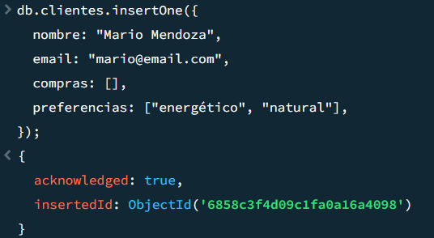

#### Lectura
- ✅ Consultar productos con stock > 20
```javascript
db.productos.find({ stock: { $gt: 20 } });
```

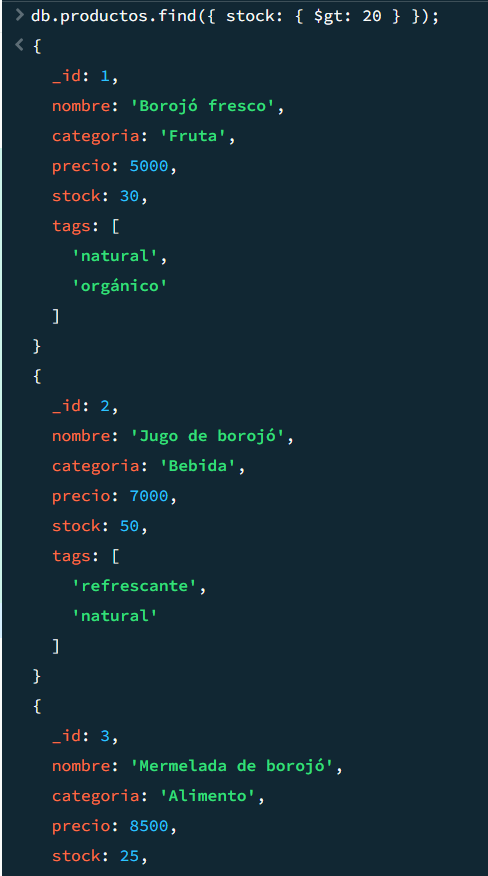
- ✅ Encontrar clientes sin compras
```javascript
db.clientes.find({ compras: { $size: 0 } });
```

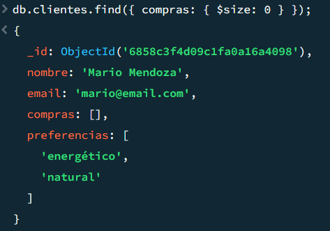

#### Actualización
- ✅ Aumentar stock de "Borojó deshidratado"
```javascript
db.productos.updateOne({ nombre: "Borojó deshidratado" }, { $inc: { stock: 10 } });
```

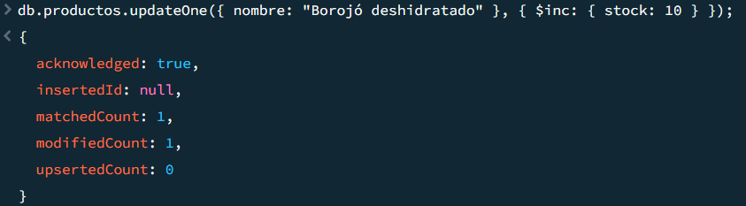
- ✅ Añadir tag "bajo azúcar" a bebidas
```javascript
db.productos.updateMany({ categoria: "Bebida" }, { $addToSet: { tags: "bajo azúcar" } });
```

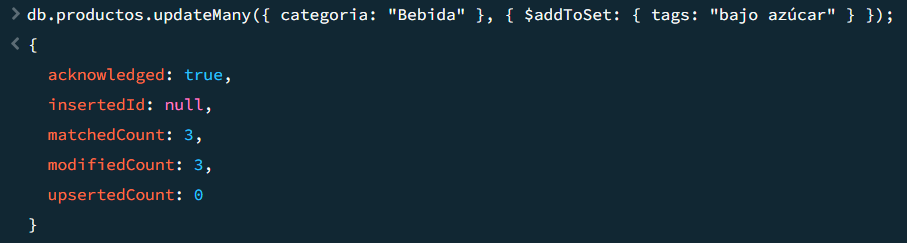
#### Eliminación
- ✅ Eliminar cliente con email "juan@email.com"
```javascript
db.clientes.deleteOne({ email: "juan@email.com" });
```

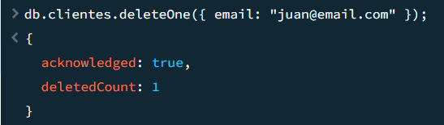
- ✅ Eliminar productos con stock < 5
```javascript
db.productos.deleteMany({ stock: { $lt: 5 } });
```
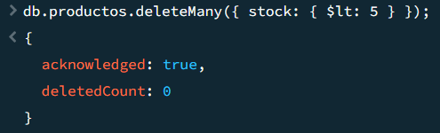

### 2. Consultas con Expresiones Regulares
- ✅ Productos que empiecen por "Boro"
```javascript
db.productos.find({ nombre: /^Boro/ });
```

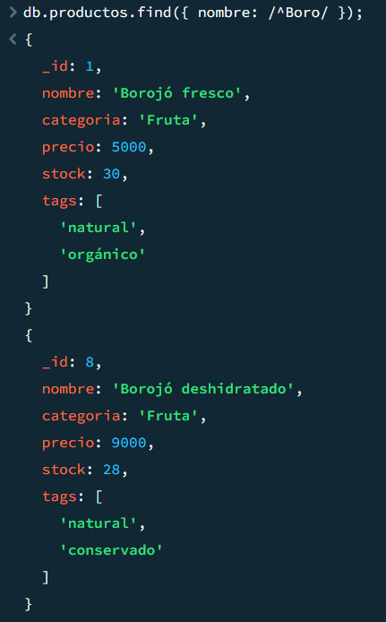
- ✅ Productos que contengan "con"
```javascript
db.productos.find({ nombre: /con/i });
```

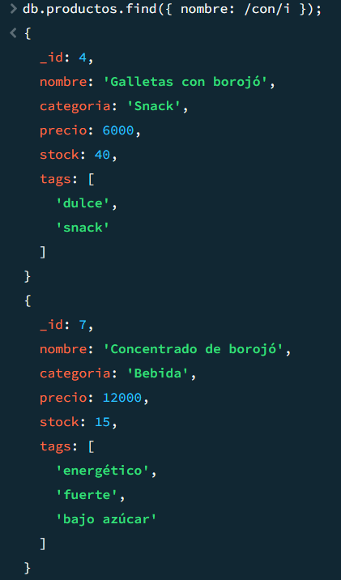
- ✅ Clientes con letra "z" en el nombre
```javascript
db.clientes.find({ nombre: /z/i });
```

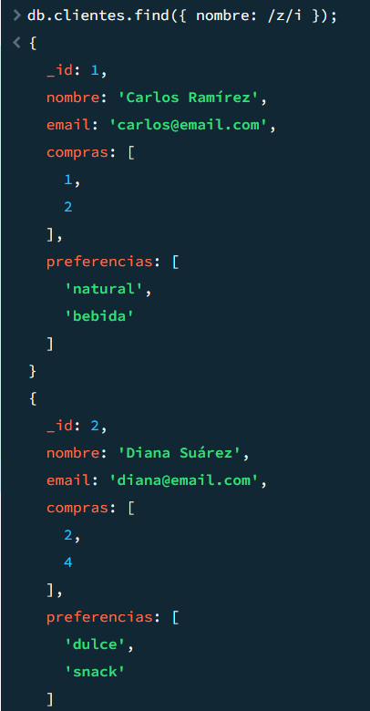
### 3. Operadores en Arrays
- ✅ Clientes con preferencia "natural"
```javascript
db.clientes.find({ preferencias: {$in: ["natural"]} });
```

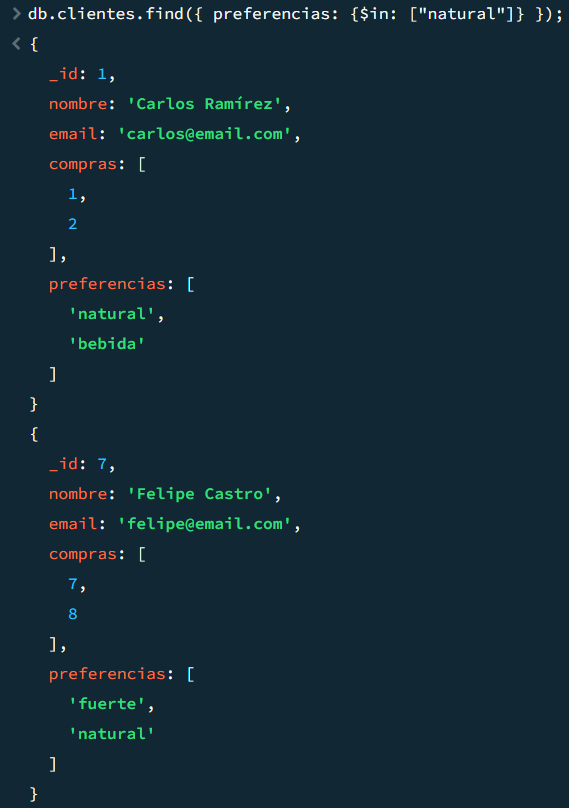
- ✅ Productos con tags "natural" y "orgánico"
```javascript
db.productos.find({tags: { $all: ["natural", "orgánico"] }});
```

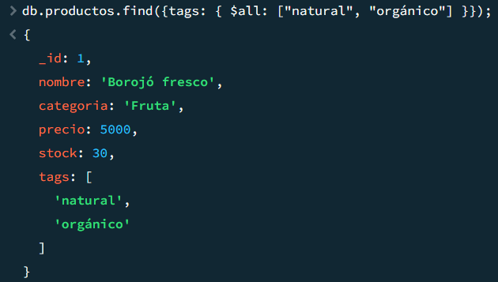
- ✅ Productos con más de un tag
```javascript
db.productos.find({$expr: { $gt: [{ $size: "$tags" }, 1] }});
```

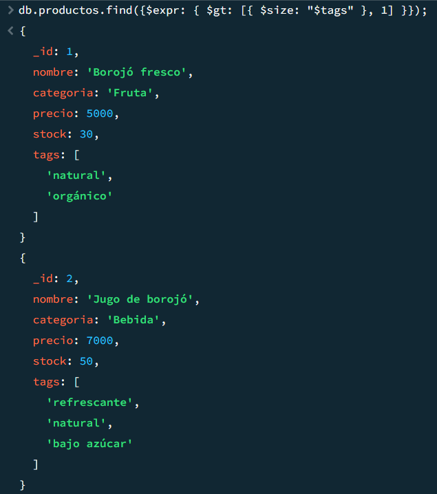
### 4. Aggregation Framework
- ✅ Productos más vendidos
```javascript
db.ventas.aggregate([
  { $unwind: "$productos" },
  {
    $group: {
      _id: "$productos.productoId",
      totalVendido: { $sum: "$productos.cantidad" },
      ventasCount: { $sum: 1 }
    }
  },
  {
    $lookup: {
      from: "productos",
      localField: "_id",
      foreignField: "_id",
      as: "infoProducto"
    }
  },
  { $unwind: "$infoProducto" },
  {
    $project: {
      nombre: "$infoProducto.nombre",
      categoria: "$infoProducto.categoria",
      totalVendido: 1,
      ventasCount: 1,
      ingresoTotal: { $multiply: ["$totalVendido", "$infoProducto.precio"] }
    }
  },
  { $sort: { totalVendido: -1 } }
]);
```

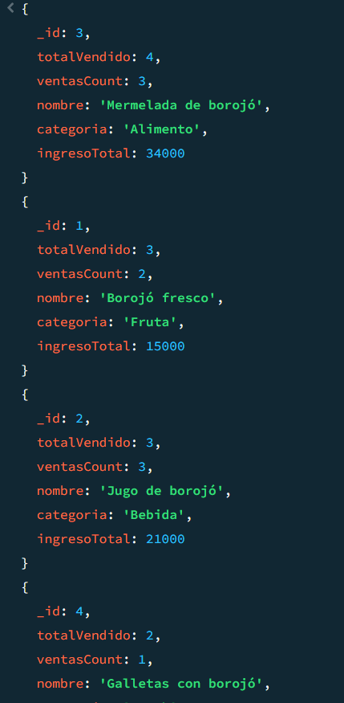
- ✅ Clientes agrupados por cantidad de compras
```javascript
db.clientes.aggregate([
  {
    $project: {
      nombre: 1,
      email: 1,
      cantidadCompras: { $size: "$compras" },
      preferencias: 1
    }
  },
  {
    $group: {
      _id: "$cantidadCompras",
      clientes: {
        $push: {
          nombre: "$nombre",
          email: "$email",
          preferencias: "$preferencias"
        }
      },
      totalClientes: { $sum: 1 }
    }
  },
  { $sort: { _id: -1 } }
]);
```

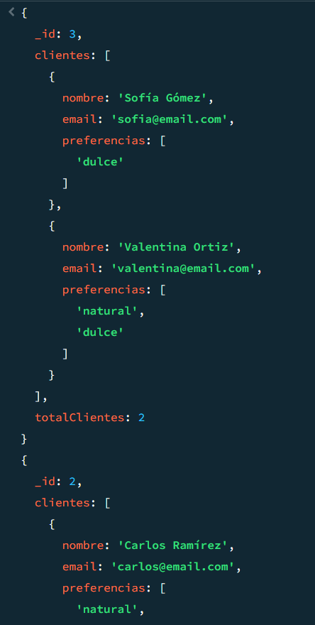
- ✅ Ventas totales por mes
```javascript
db.ventas.aggregate([
  {
    $group: {
      _id: {
        año: { $year: "$fecha" },
        mes: { $month: "$fecha" }
      },
      totalVentas: { $sum: "$total" },
      cantidadVentas: { $sum: 1 },
      promedioVenta: { $avg: "$total" }
    }
  },
  { $sort: { "_id.año": 1, "_id.mes": 1 } }
]);
```

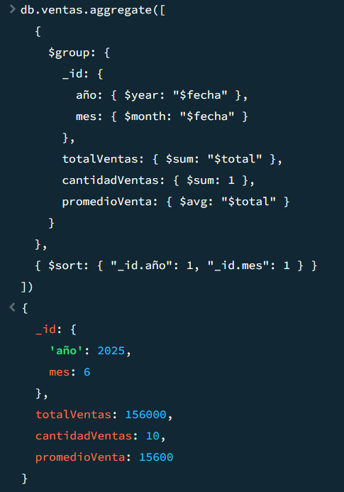
- ✅ Promedio de precios por categoría
```javascript
db.productos.aggregate([
  {
    $group: {
      _id: "$categoria",
      precioPromedio: { $avg: "$precio" },
      precioMinimo: { $min: "$precio" },
      precioMaximo: { $max: "$precio" },
      cantidadProductos: { $sum: 1 },
      stockTotal: { $sum: "$stock" }
    }
  },
  { $sort: { precioPromedio: -1 } }
]);
```

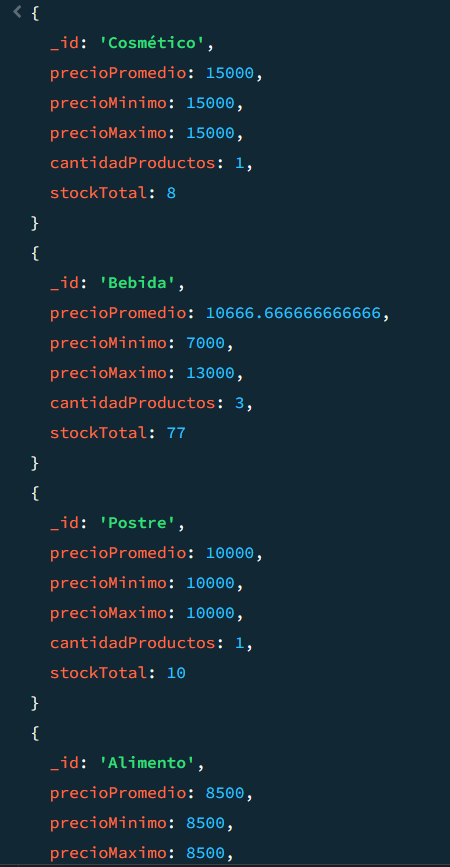
- ✅ Top 3 productos con mayor stock
```javascript
db.productos.aggregate([
  { $sort: { stock: -1 } },
  { $limit: 3 },
  {
    $project: {
      nombre: 1,
      categoria: 1,
      stock: 1,
      precio: 1,
      valorInventario: { $multiply: ["$stock", "$precio"] },
      tags: 1
    }
  }
]);
```

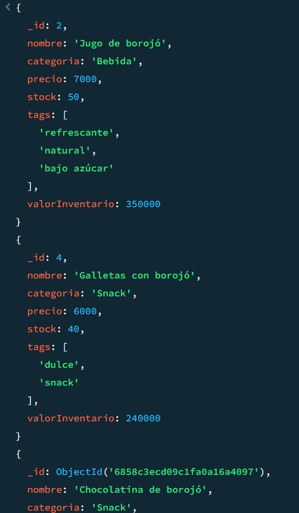
### 5. Funciones definidas
- ✅ `calcularDescuento(precio, porcentaje)`
```javascript
function calcularDescuento(precio, porcentaje) {
  if (typeof precio !== "number" || typeof porcentaje !== "number") {
    throw new Error("Los parámetros deben ser números");
  }
  
  if (precio < 0 || porcentaje < 0 || porcentaje > 100) {
    throw new Error("Precio debe ser positivo y porcentaje entre 0-100");
  }
  
  const descuento = (precio * porcentaje) / 100;
  const precioFinal = precio - descuento;
  
  return {
    precioOriginal: precio,
    porcentajeDescuento: porcentaje,
    montoDescuento: descuento,
    precioFinal: precioFinal,
    ahorroTotal: descuento
  };
}
```

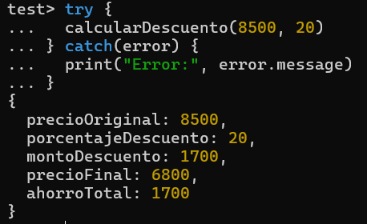
- ✅ `clienteActivo(idCliente)`
```javascript
function clienteActivo(idCliente) {
  if (typeof idCliente !== "number") {
    throw new Error("El ID del cliente debe ser un número");
  }
  
  const cliente = db.clientes.findOne({ _id: idCliente });
  
  if (!cliente) {
    return {
      existe: false,
      activo: false,
      mensaje: `Cliente con ID ${idCliente} no encontrado`
    };
  }
  
  const cantidadCompras = cliente.compras.length;
  const esActivo = cantidadCompras > 3;
  
  return {
    existe: true,
    clienteId: idCliente,
    nombre: cliente.nombre,
    email: cliente.email,
    cantidadCompras: cantidadCompras,
    activo: esActivo,
    mensaje: esActivo 
      ? `Cliente ${cliente.nombre} es ACTIVO (${cantidadCompras} compras)`
      : `Cliente ${cliente.nombre} no es activo (${cantidadCompras} compras, necesita más de 3)`
  };
}
```

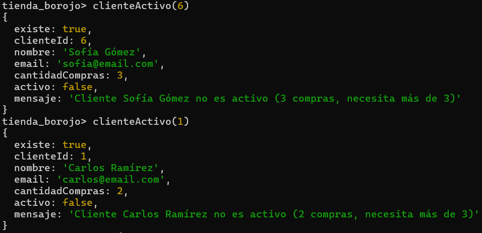
- ✅ `verificarStock(productoId, cantidadDeseada)`
```javascript
function verificarStock(productoId, cantidadDeseada) {
  if (typeof productoId !== "number" || typeof cantidadDeseada !== "number") {
    throw new Error("Los parámetros deben ser números");
  }
  
  if (cantidadDeseada <= 0) {
    throw new Error("La cantidad deseada debe ser mayor a 0");
  }
  
  const producto = db.productos.findOne({ _id: productoId });
  
  if (!producto) {
    return {
      existe: false,
      disponible: false,
      mensaje: `Producto con ID ${productoId} no encontrado`
    };
  }
  
  const stockDisponible = producto.stock;
  const hayStock = stockDisponible >= cantidadDeseada;
  
  return {
    existe: true,
    productoId: productoId,
    nombre: producto.nombre,
    stockActual: stockDisponible,
    cantidadSolicitada: cantidadDeseada,
    disponible: hayStock,
    faltante: hayStock ? 0 : cantidadDeseada - stockDisponible,
    mensaje: hayStock 
      ? `Stock suficiente: ${stockDisponible} disponibles, solicita ${cantidadDeseada}`
      : `Stock insuficiente: ${stockDisponible} disponibles, solicita ${cantidadDeseada}, faltan ${cantidadDeseada - stockDisponible}`
  };
}
```

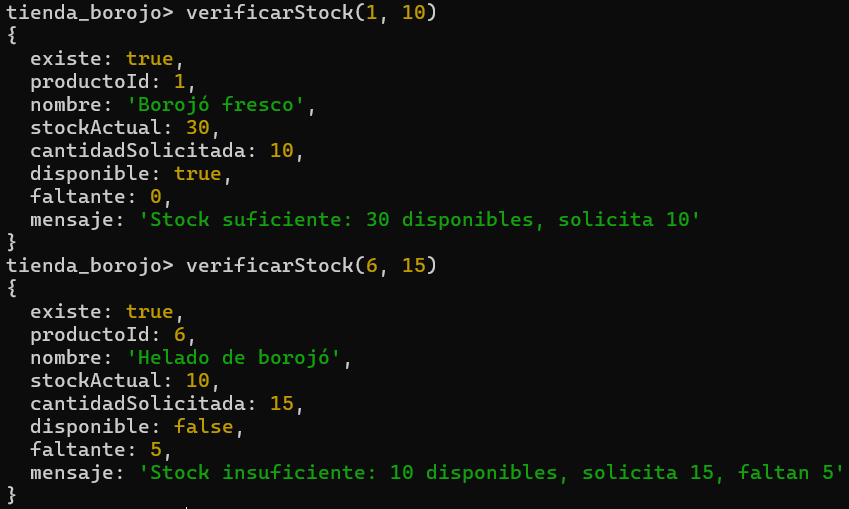
### 6. Transacciones
```javascript
- ✅ Simular venta con transacción
// Iniciar sesión y transacción
const session = db.getMongo().startSession();

try {
  session.startTransaction();
  
  // Datos de la venta
  const ventaData = {
    clienteId: 6,
    productoId: 2, // Jugo de borojó
    cantidad: 3,
    precioUnitario: 7000
  };
  
  // Operación 1: Descontar del stock
  const resultadoStock = db.productos.updateOne(
    { 
      _id: ventaData.productoId, 
      stock: { $gte: ventaData.cantidad } 
    },
    { $inc: { stock: -ventaData.cantidad } },
    { session: session }
  );
  
  if (resultadoStock.modifiedCount === 0) {
    throw new Error("Stock insuficiente o producto no encontrado");
  }
  
  // Operación 2: Insertar la venta
  const nuevaVenta = {
    _id: db.ventas.countDocuments() + 1,
    clienteId: ventaData.clienteId,
    productos: [{
      productoId: ventaData.productoId,
      cantidad: ventaData.cantidad
    }],
    fecha: new Date(),
    total: ventaData.cantidad * ventaData.precioUnitario
  };
  
  const resultadoVenta = db.ventas.insertOne(nuevaVenta, { session: session });
  
  // Confirmar transacción
  session.commitTransaction();
  print("✅ Venta procesada exitosamente");
  print(`Nueva venta ID: ${resultadoVenta.insertedId}`);
  
} catch (error) {
  session.abortTransaction();
  print(`❌ Transacción abortada: ${error.message}`);
} finally {
  session.endSession();
}
```


- ✅ Entrada de inventario con transacción
```javascript
// Iniciar sesión y transacción
const session2 = db.getMongo().startSession();

try {
  session2.startTransaction();
  
  // Datos del inventario
  const inventarioData = {
    productoId: 8, // Borojó deshidratado
    lote: "L011",
    cantidad: 25
  };
  
  // Operación 1: Insertar registro en inventario
  const nuevoInventario = {
    _id: db.inventario.countDocuments() + 1,
    productoId: inventarioData.productoId,
    lote: inventarioData.lote,
    cantidad: inventarioData.cantidad,
    entrada: new Date()
  };
  
  const resultadoInventario = db.inventario.insertOne(
    nuevoInventario, 
    { session: session2 }
  );
  
  // Operación 2: Aumentar stock del producto
  const resultadoStock = db.productos.updateOne(
    { _id: inventarioData.productoId },
    { $inc: { stock: inventarioData.cantidad } },
    { session: session2 }
  );
  
  if (resultadoStock.modifiedCount === 0) {
    throw new Error("No se pudo actualizar el stock del producto");
  }
  
  // Confirmar transacción
  session2.commitTransaction();
  print("✅ Entrada de inventario procesada exitosamente");
  print(`Nuevo registro inventario ID: ${resultadoInventario.insertedId}`);
  print(`Stock aumentado en ${inventarioData.cantidad} unidades`);
  
} catch (error) {
  session2.abortTransaction();
  print(`❌ Transacción de inventario abortada: ${error.message}`);
} finally {
  session2.endSession();
}
```


- ✅ Operación de devolución
```javascript
// Iniciar sesión y transacción
const session3 = db.getMongo().startSession();

try {
  session3.startTransaction();
  
  // Buscar la última venta para devolver
  const ventaADevolver = db.ventas.findOne({}, { sort: { _id: -1 } });
  
  if (!ventaADevolver) {
    throw new Error("No hay ventas para devolver");
  }
  
  print(`Procesando devolución de venta ID: ${ventaADevolver._id}`);
  
  // Operación 1: Restaurar stock de cada producto vendido
  for (let producto of ventaADevolver.productos) {
    const resultadoStock = db.productos.updateOne(
      { _id: producto.productoId },
      { $inc: { stock: producto.cantidad } },
      { session: session3 }
    );
    
    if (resultadoStock.modifiedCount === 0) {
      throw new Error(`No se pudo restaurar stock del producto ${producto.productoId}`);
    }
    
    print(`Stock restaurado: +${producto.cantidad} unidades del producto ${producto.productoId}`);
  }
  
  // Operación 2: Eliminar la venta
  const resultadoEliminacion = db.ventas.deleteOne(
    { _id: ventaADevolver._id },
    { session: session3 }
  );
  
  if (resultadoEliminacion.deletedCount === 0) {
    throw new Error("No se pudo eliminar la venta");
  }
  
  // Confirmar transacción
  session3.commitTransaction();
  print("✅ Devolución procesada exitosamente");
  print(`Venta ${ventaADevolver._id} eliminada`);
  print(`Total devuelto: $${ventaADevolver.total}`);
  
} catch (error) {
  session3.abortTransaction();
  print(`❌ Transacción de devolución abortada: ${error.message}`);
} finally {
  session3.endSession();
}
```


### 7. Indexación
- ✅ Índice en campo `nombre` de productos
```javascript
// Crear índice simple en el campo nombre
db.productos.createIndex({ nombre: 1 })

// Verificar que el índice se creó correctamente
db.productos.getIndexes()
```
- ✅ Índice compuesto `categoria` y `precio`
```javascript
// Crear índice compuesto (categoria ascendente, precio descendente)
db.productos.createIndex({ categoria: 1, precio: -1 })

// Verificar índices de la colección productos
db.productos.getIndexes()
```
- ✅ Índice en `email` de clientes
```javascript
// Crear índice único en email para evitar duplicados
db.clientes.createIndex({ email: 1 }, { unique: true })

// Verificar índices de la colección clientes
db.clientes.getIndexes()
```
- ✅ Análisis con `explain()`
```javascript
// Consulta simple usando el índice de nombre
db.productos.find({ nombre: "Borojó fresco" }).explain("executionStats")

// Consulta con patrón regex (puede no usar índice eficientemente)
db.productos.find({ nombre: /^Boro/ }).explain("executionStats")

// Consulta que definitivamente usa el índice
db.productos.find({ nombre: "Jugo de borojó" }).explain("executionStats")
```

## Tecnologías Utilizadas
- **MongoDB 7.0+**
- **MongoDB Shell (mongosh)**
- **JavaScript** para funciones personalizadas
- **JSON** para datos de prueba

## Estructura de Archivos
```
tienda-borojo-mongodb/
├── README.md
├── data/
│   ├── productos.json
│   ├── clientes.json
│   ├── ventas.json
│   ├── inventario.json
│   └── proveedores.json
└── scripts/
    ├── 01-inicializacion.js
    ├── 02-crud-insercion.js
    ├── 03-crud-lectura.js
    ├── 04-crud-actualizacion.js
    ├── 05-crud-eliminacion.js
    ├── 06-expresiones-regulares.js
    ├── 07-operadores-arrays.js
    ├── 08-aggregation-framework.js
    ├── 09-transacciones.js
    ├── 10-indexacion.js
    └── script.js
```